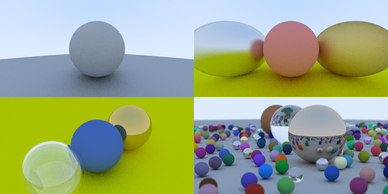

# MyRayTracer

January 2021 
Letter: I meant to learn more about graphics in order to complete my personal project on Raymarching. This is what I ve learnt so far and I am planning to optimize this simple raytracer by using CUDA API provided by NVIDIA. If I increase the FPS, I will be able to implement a camera. 
A functional raytracer exploring the maths behind the pixels with the help of the online version of the book: Raytracing in a Weekend.
 
Implemented in OpenGl.

Libraries used:
GLFW
GLEW

Implemented:
 
Vector class. 
Raycasting. 
Primitive shape: sphere. 
Shading and surface normals. 
Diffuse Material. 
Mirrored Light Reflection. 
 
A Makefile would spare the trouble of installing the different libraries. This is a plan for the recent future.
 
An example of my learning achievements:

